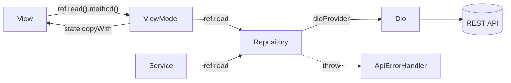

# 📱 프로젝트 개요
- T-BANK 사용자용 Flutter 모바일 앱 (Dart SDK ^3.8.1)
- 아키텍처: Riverpod + MVVM(BaseView/BaseViewModel/BaseViewState) + Repository 계층
- 데이터 흐름: View → ViewModel → Repository → Dio → API
- 상세 구조·의존성 다이어그램: [`docs/ARCHITECTURE.md`](docs/ARCHITECTURE.md)
- 기술 결정 근거(왜 이렇게 했나): [`docs/adr/`](docs/adr/README.md)
- AI 운영: agent 작업 로그(session log)는 `.dev/`, 성과 측정(eval)은 [`evals/`](evals/README.md)·`agent-results.json`

# 🛠️ 명령어 (Commands)
- **의존성 설치:** `flutter pub get`
- **코드 생성(필수):** `dart run build_runner build --delete-conflicting-outputs`
  - freezed/json_serializable 모델 수정 시 반드시 실행 (`*.freezed.dart`, `*.g.dart` 재생성)
- **실행:** `flutter run`
- **분석/린트:** `flutter analyze` (flutter_lints 기본 규칙)
- **테스트:** `flutter test`

# 🧱 기술 스택
- **상태관리:** flutter_riverpod ^2.5.1 (NotifierProvider.autoDispose, FutureProvider.family, StateProvider)
- **네트워크:** dio ^5.9.0 (+ http 보조), 인터셉터는 `util/helper/network_helper.dart`의 `dioProvider`
- **코드생성:** freezed, json_serializable, build_runner
- **푸시/알림:** firebase_core, firebase_messaging, flutter_local_notifications
- **로컬저장:** flutter_secure_storage(토큰), shared_preferences
- **UI:** flutter_svg, flutter_easyloading, fluttertoast, liquid_pull_to_refresh
- **라우팅:** go_router 미사용 → 네이티브 Named Route + onGenerateRoute

# 🚪 진입점 (Entry Point)
- `lib/main.dart`
  1. `WidgetsFlutterBinding.ensureInitialized()`
  2. `Firebase.initializeApp()` + 백그라운드 메시지 핸들러 등록
  3. `ProviderContainer` 수동 생성 후 `fcmServiceProvider.initialize()` (토큰·권한·리스너)
  4. `runApp(UncontrolledProviderScope(...))` → `MyApp(ConsumerWidget)`
  5. `MaterialApp`: navigatorKey/scaffoldMessengerKey, EasyLoading, `initialRoute: splash`, `RoutePath.onGenerateRoute`
- 전역 키: `lib/common/app_global.dart` / 라우팅: `lib/util/route_path.dart`

# 📂 폴더 구조 (lib/)
- `common/`      전역 키·상수 (navigatorKey, 저장소 키)
- `model/`       도메인 모델 (User, AccountModel, UserProfileModel — 대부분 수동 클래스)
- `provider/`    전역 Riverpod Provider (예: account_status_provider)
- `repository/`  데이터 계층 (auth/account/transfer/bank/system) — Dio 호출, Exception throw
  - `repository/response/`  API 응답 모델 (일부 freezed)
- `service/`     비즈니스 로직 (auth_service, fcm_service, theme_service)
- `view/`        프레젠테이션 (Feature-First). 각 feature = `*_view` + `*_view_model` + `*_view_state`
  - `view/base_view*.dart`  MVVM 공통 베이스 (제네릭 래퍼)
  - 주요 feature: login, register, splash, home(all/my/view), transfer, transaction_history, authority, account_info, create_account
- `theme/`       테마·재사용 위젯 (button, toast, refresh, foundation, skeleton)
- `res/`         palette / typo / layout 상수
- `util/`        route_path, app_config, app_dialog, enums
  - `util/helper/`  network_helper(dioProvider), api_error_handler, app_exception, formatter
- 구조 요약: **View는 Feature-First, Data는 Layer-First 혼합**
- **문서 분리 원칙:** `docs/`=사람 문서(사양·결정·룰, 영속·git추적, 비즈니스 진실의 출처) / `.dev/`=AI 작업 로그(휘발성·gitignore). 비즈니스 진실은 항상 `docs/` 기준.

# ⚠️ 중복 패턴 (정리·통일 필요 — 신규 코드 작성 시 주의)
0. **⚠️ pubspec.yaml 의존성 오배치** — 런타임 패키지 다수가 `dev_dependencies`에 위치
   (flutter_riverpod, http, permission_handler, image_picker, shared_preferences, flutter_easyloading, fluttertoast, flutter_svg, path_provider, video_player, share_plus 등)
   → `flutter pub get`은 통과하나, 패키지 추가/정리 시 블록 확인 필요
1. **모델 정의 혼용**
   - freezed: `repository/response/account_response.dart`, `.../authority/account_authority_response.dart`
   - 수동 class: `model/user.dart`, `model/account.dart`, `model/user_profile_model.dart`, `.../account_search/account_searchtype_response.dart`
2. **에러 반환 방식** ✅ 통일됨 ([ADR 0005](docs/adr/0005-api-call-via-repository.md))
   - API 호출은 ViewModel→Repository 직접 호출 표준. Repository는 항상 `throw ApiErrorHandler.parse(e)`
   - 미사용 `auth_service`/`account_service` 래퍼(bool/String? 혼용) 제거됨. `service/`는 fcm·theme만
3. **ViewModel 에러 처리 혼용** — State저장+bool반환 / State저장만 / String?반환 4가지 패턴
   - 예: `login_view_model.dart`(bool), `account_info_view_model.dart`(void), `register_view_model.dart`(String?)
4. **View 에러 UI 혼용**
   - `ref.listen`+SnackBar: `view/home/my/my_accont_view.dart`
   - state 직접 렌더: `view/login/login_view.dart`
   - AppDialog: `util/app_dialog.dart` / Toast: `theme/toast/toast.dart`
5. **네비게이션 혼용** — `Navigator.pushNamed`(View) vs `navigatorKey.currentState`(fcm_service) vs onGenerateRoute
6. **State 초기화 혼용** — `const` 생성자 직접 호출 vs `factory .initial()`

# 📝 코딩 컨벤션
- **파일명:** snake_case. feature는 `xxx_view / xxx_view_model / xxx_view_state` 3종 세트
  - ⚠️ 오타·비표준 잔존: `transation_history`(→transaction), `my_accont_view`(→account), `authority_view.state.dart`(`.` 구분자)
- **클래스명:** PascalCase. ⚠️ `View`와 `Screen` 접미사 혼용(LoginView vs TransferScreen)
- **Provider:** `xxxRepositoryProvider`, `xxxViewModelProvider`, `xxxServiceProvider`, `xxxProvider`(상태)
- **에러:** 커스텀 `AppException`(util/helper/app_exception.dart), `ApiErrorHandler.parse()`로 Dio 에러 → 한글 메시지 변환 (타임아웃/연결불가/HTTP status별), 404는 일부 정상(null) 처리
- **DI:** Provider 기반. 호출은 `ref.read()`, 의존성 추적 필요 시 `ref.watch()`
- **상태 불변성:** `copyWith` 패턴, AutoDispose Notifier 기본

# ⚡️ 트리거 키워드 및 행동 강령
- **플랜 모드 필수:** 코드를 즉시 치지 말고 반드시 `Plan`을 먼저 제시해라.
- **에러 로그:** 에러가 나면 네가 요약하지 말고 스택 트레이스 원문을 나에게 보여라.
