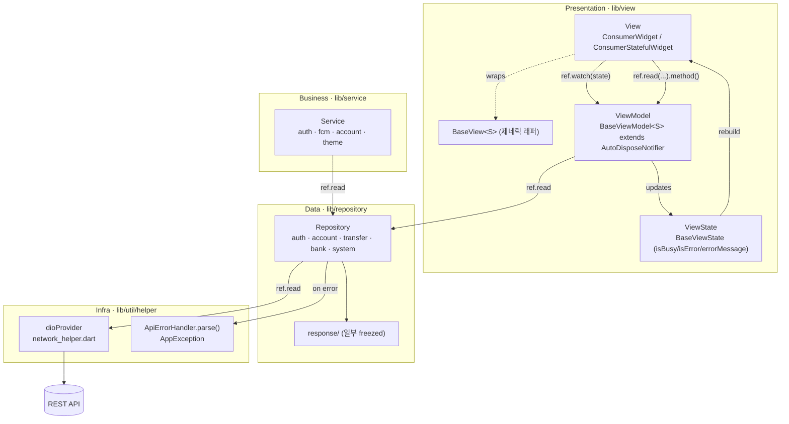
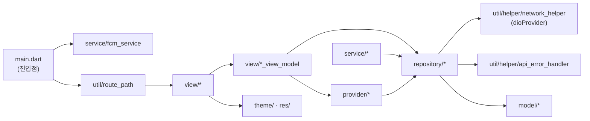
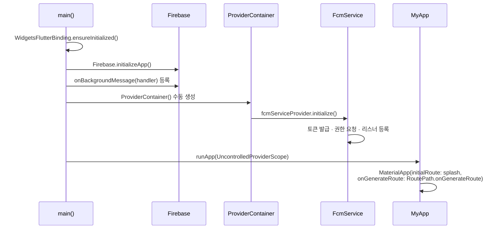

# 🏛️ Architecture — tbank_user

T-BANK 사용자용 Flutter 앱. **Riverpod + MVVM(BaseView/BaseViewModel/BaseViewState) + Repository 계층** 구조.
단일 앱(모놀리식)이며, View는 Feature-First·데이터 계층은 Layer-First로 구성된다.

## 레이어 & 데이터 흐름

사용자 입력 → View가 ViewModel 메서드 호출 → ViewModel이 Repository를 통해 API 호출 → 결과를 `state`로 반영 → View가 rebuild.

### 흐름 규칙
- **상태 읽기:** `ref.watch(xxxViewModelProvider)` — rebuild 트리거
- **메서드 호출:** `ref.read(xxxProvider).method()` — 일회성
- **상태 불변성:** `copyWith` 패턴, `AutoDispose` Notifier 기본
- **에러:** Repository가 `throw ApiErrorHandler.parse(e)` → ViewModel이 catch 후 `state`에 반영 → View가 표시

## 모듈 의존성

### 의존성 방향 원칙
- **단방향:** Presentation → Business/Data → Infra. 역방향 의존 없음.
- **DI:** 모든 의존성은 Riverpod Provider로 주입 (`authRepositoryProvider`, `dioProvider`, `fcmServiceProvider` 등).
- **전역 접근:** `navigatorKey`/`scaffoldMessengerKey`(common/app_global.dart)는 FCM 알림 클릭·Toast에서 context 없이 네비게이션/스낵바 표시에 사용.

## 진입점 부트스트랩

## 라우팅
- **방식:** go_router 미사용 → 네이티브 Named Route + `RoutePath.onGenerateRoute` (`util/route_path.dart`)
- **라우트:** splash · login · register · home · transfer_history · account_authority
- **파라미터:** `settings.arguments`로 String 또는 Map 전달
- **공통 래핑:** 모든 화면을 `ConstrainedScreen`으로 감싸 반응형 대응

## 알려진 구조적 부채
중복·혼용 패턴은 루트 [`CLAUDE.md`](../CLAUDE.md)의 "⚠️ 중복 패턴" 섹션 참조. 요약:
- 모델 정의: freezed vs 수동 class 혼용
- 에러 반환: Repository(Exception) vs Service(bool/String?/void)
- ViewModel 에러 처리: 4가지 패턴 혼재
- View 에러 UI: ref.listen / state 렌더 / AppDialog / Toast
- 네비게이션: Navigator.pushNamed / navigatorKey / onGenerateRoute
- pubspec.yaml: 런타임 패키지 다수가 `dev_dependencies`에 오배치
